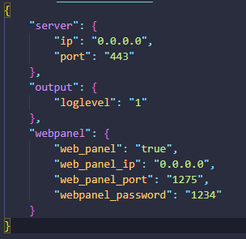
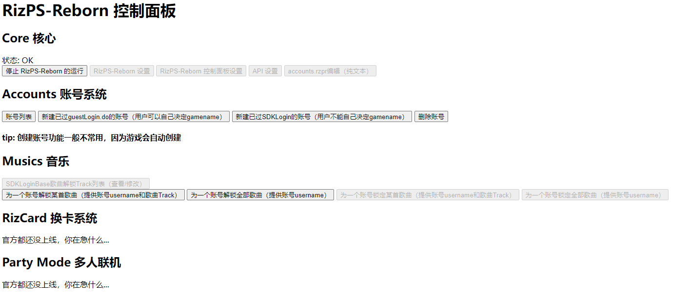

# 开始使用 - Hello RizPS-Reborn!

## 1.运行RizPS-Reborn（两种方法二选一）
### 推荐：下载并运行可执行文件（方法一）
你可以从[Github Release](https://github.com/osp-project/RizPS-Reborn/releases)中下载RizPS-Reborn的 **最新** 可执行文件，名称看起来大概是`RizPS-Reborn-版本.zip`，下载并解压后便能得到RizPS-Reborn的可执行文件和一些附带的必要文件了，请一定要把`RizPS-Reborn.exe`和那些附带的文件或文件夹放在一起，否则将无法启动RizPS-Reborn。

得到可执行文件后，直接双击`RizPS-Reborn.exe`即可运行RizPS-Reborn。哦买噶，这实在是太简单了！接下来，请保持RizPS-Reborn的运行，并且不要关闭弹出的命令行窗口，因为关闭弹出的窗口=关闭RizPS-Reborn

但请注意，Release中下载的可执行文件并非一定是最新构建，且仅支持Windows平台，若有需求体验最新构建或您正在使用MacOS/Linux系统，请[自行编译](/?id=%e8%87%aa%e8%a1%8c%e7%bc%96%e8%af%91)
### 自行编译（方法二）
安装`git` `rust` `cargo`

克隆此仓库：

`git clone github.com/osp-project/rizps-reborn`

<br/>

#### 安装OpenSSL开发套件（Linux）

```shell
sudo apt install libssl-dev #Ubuntu
sudo dnf install openssl-devel #Fedora
sudo pacman -S openssl #ArchLinux
sudo yum install openssl openssl-devel #CentOS
...其它发行版也可参考这些命令，但可能会在包名和包管理器命令上有所区别
```

<br/>

#### 安装OpenSSL开发套件（Windows）

从[这里](https://slproweb.com/products/Win32OpenSSL.html)下载最新版本的Win64 OpenSSL Installer

下完毕后直接双击打开然后安装，安装时请记住安装路径

安装完毕后打开cmd，用以下命令设置***临时***环境变量，我相信你会自己替换路径的对吧？
```cmd
$env:OPENSSL_LIB_DIR="C:\Program Files\OpenSSL-Win64\lib"
$env:OPENSSL_INCLUDE_DIR="C:\Program Files\OpenSSL-Win64\include"
$env:OPENSSL_DIR="C:\Program Files\OpenSSL-Win64"
```
请注意：此处设置的是***临时***环境变量，只在执行了这3行命令的cmd窗口中生效，编译命令也必须在此窗口中执行，若新开一个cmd窗口，则需再执行一遍这3行命令
<br/>

#### 编译并运行

`cargo run`

我是warnings之神，52warnings不急，不理睬就没事.jpg

## 2.使用Fiddler Classic进行流量转发

### 在电脑上安装Fiddler Classic

从[官网](https://www.telerik.com/fiddler/fiddler-classic)下载并安装Fiddler Classic

安装后，打开，你将进入程序主界面，并会有提示要求你在电脑上安装证书之类的，全部Yes一路装下去，到了能自行操作的时候，点击上方菜单栏的 `Tools` ，再点 `Options` ，然后点击弹出窗口中的菜单栏中的`HTTPS`，确保已勾选以下选项，没勾选就勾上：
```
[x] Capture HTTPS CONNECTs
[x] Decrypt HTTPS traffic
[x] Ignore server certificate errors (unsafe)
```
再点击Options窗口菜单栏中的`Connections`，勾选：
```
[x] Allow remote computers to connect
```
最后，点击下方的`OK`保存设置，保持Fiddler开启，并按照下面的教程继续操作：

### 在手机上的操作

#### Android（需root和system分区可写，无root方法正在进行内部测试）

从[Releases](../../releases)中的最新版本Assets里下载`AndroidFiddlerSSLCertHelper.zip`，解压后运行里面的`AndroidFiddlerSSLCertHelper.exe`，此时就能看到文件夹里多了一个以8个字母或数字组成文件名并且后缀为`.0`的文件，将它传到手机上

传到手机上后，用可以修改根目录的文件管理器，如 **MT管理器** 和 **RE文件管理器**，将刚刚传到手机上的那个文件放到根目录里的system文件夹里的etc里的security里的cacerts文件夹里，路径为：`/system/etc/security/cacerts/`，然后重启手机

最后，从[Releases](../../releases)里下载Proxydroid.apk，装到手机上，然后打开它，Proxydroid会向你请求root权限，允许一下，然后看到`Proxy Settings`这块，将Host改为 **对于你手机来说你电脑的IP地址**，Port改为`8888`，Proxy Type改为`HTTP`，然后回到最上面，关掉`Proxy Switch`，`Proxy Switch`只因在游玩RizPS-Reborn时开启，否则会无法正常联网。因为后面还要安装RizPS-Reborn定制客户端，考虑到需要联网，所以先关闭这个选项

#### iOS
首先，打开Safari浏览器（一定要是Safari浏览器，否则无法正常下载并安装证书！！！），在地址栏输入`http://对于你手机来说你电脑的IP地址:8888`，假如对于我手机来说，我电脑IP是`192.168.50.89`，那么我就应该输入`http://192.168.50.89:8888`，然后访问，你应该会看到`Fiddler Echo Service`这几个大字和一堆小字，如果你没看到，就代表你的IP填错了或fiddler没开启。接着，点击蓝色带下划线的`FiddlerRoot certificate`，浏览器会弹出个窗口让你忽略还是允许，点允许，然后到`设置 > 通用 > VPN与设备管理 > 已下载的描述文件`里找到`DO_NOT_TRUST_FiddlerRoot`，点进去，输密码安装，然后再到`设置 > 通用 > 关于本机`，拉到最下面，找到`证书信任设置`，点进去，把`DO_NOT_TRUST_FiddlerRoot`打开

然后，安装Shadowrocket，你可以自己用非国区id买，也可以去百度或者谷歌找免费的共享账号免费下载

安装完成后，打开Shadowrocket，点击右上角的+号，会来到一个添加节点页面，类型选`HTTP`，地址填**对于你手机来说你电脑的IP地址**，端口8888，其它的全部别管，点右上角的保存

然后，首页里就多了个`本地节点`，先别着急勾选并连接，因为只有在游玩RizPS-Reborn时才需要连接，否则会无法正常联网。接着来到下方的`配置`选项卡，点击右上角的+号，url输`https://github.com/osp-project/RizPS-Reborn/raw/master/req_files/ios_shadowrockets_conf.conf`（建议发到手机上然后复制粘贴，自己打容易错也费时间），然后点下载，就会看到下面多了个`远程文件`，点一下拿个多了的远程文件，点`使用配置`，然后就整好了，请继续按下面的教程操作

有一点请注意：如果你需要通过Shadowrocket连梯子，建议切回default.conf，当然不切也行，但可能导致telegram等软件无法连网

## 3.安装或制作RizPS-Reborn定制游戏客户端（两种方法二选一）

### 为什么要使用定制客户端而非官方客户端？

因为游戏加密的特殊性，要连接RizPS-Reborn必须对游戏包体进行些许修改，因此，需要使用定制客户端

### 直接下载并安装RizPS-Reborn定制客户端（推荐）
#### 下载链接

> 注意：这些定制客户端仅限于在[https://github.com/osp-project/RizPS-Reborn](https://github.com/osp-project/RizPS-Reborn)开源的RizPS-Reborn使用，其它衍生版本可能无法使用

Android：https://drive.google.com/file/d/10WJjUsnQ0btQWZu9Pw1jYgcOP_Z3JoD8/view?usp=sharing 下载并直接安装即可 打开下载链接需要梯子

iOS：https://drive.google.com/file/d/1Yc7otQH9tXZ2d04bh6_dC_MAXfsbMBGW/view?usp=sharing 打开下载链接需要梯子 请看下方安装[教程](/?id=ios%e5%ae%89%e8%a3%85%e6%95%99%e7%a8%8b)安装

#### Android安装教程

直接下载apk，然后安装，完事

#### iOS安装教程

安装 [iTunes](https://www.apple.com/itunes/download/win64)

下载 [Sideloadly](https://sideloadly.io/#download)

以 **管理员身份** 打开Sideloadly，选择你的手机和下载的ipa文件，然后输入你的AppleID（通常是邮箱），再点Advanced Options，勾选下面的Remove limit on supported devices，然后直接点下面的Start，按照提示输入密码和验证码，然后等一段时间，如果没出错的话，手机上就会出现游戏图标 在安装时出现任何问题都请换一个AppleID或者重启电脑试试 谁知道呢 万一有用呢

此时直接打开游戏是打不开的，你需要信任开发者并开启开发者模式：

开启开发者模式：设置 > 隐私与安全性 > 开发者模式，打开开发者模式，随后按照提示重启设备并输入密码即可

信任开发者：设置 > 通用 > VPN与设备管理 > 开发者app（名称为你的appleid邮箱） > 信任，按照提示输入密码并信任即可

然后这部分就完成了，继续看下去吧~

### 制作RizPS-Reborn定制客户端（不推荐）
注意：自行制作RizPS-Reborn定制客户端需要有一定的Unity逆向基础

下载最新版游戏客户端包体，安卓自行用apktool解包，iOS自行破壳，然后解压

使用[MetaDataStringEditor](https://github.com/JeremieCHN/MetaDataStringEditor)打开游戏客户端的metadata，搜索RSA公钥统一开头（MIICI），然后将相符项替换为RizPS-Reborn程序目录下的RizPS-Reborn-Custom-RSA-Keys文件夹里的public.pem里的内容，去掉`-----BEGIN PUBLIC KEY-----`和`-----END PUBLIC KEY-----`

然后搜索`/lvdgj/version/release/410001_main.dis`和`/lvdgj/version/release/310001_main.dis`，分别替换为`/lvdgj/version/release/410001_rizps.is`和`/lvdgj/version/release/310001_rizps.is`，这主要是为了将私服和官服做区分

最后搜索`google`，替换为`amazon`（绕过地域检测）

然后安卓用apktool打包，iOS直接压缩改后缀ipa，最后装上就行

## 4.配置Fiddler Script
回到Fiddler，可以看到右上方有个`Fiddler Script`，点一下，可以看到有一大片输入框给你写代码，写入：
```js
import System;
import System.Windows.Forms;
import Fiddler;
import System.Text.RegularExpressions;

class Handlers
{
    
    static var server_ip = "192.168.50.89"//修改为对手机来说你电脑的ip    
    static var server_port = 443//修改为你config里服务器的端口，默认为443不用动
    
    static function OnBeforeRequest(oS: Session) {
        if(oS.host.Contains("google") || oS.host.Contains("amazon") || oS.host.Contains("baidu")){
            if (oS.HTTPMethodIs("CONNECT"))
            {
                oS["x-replywithtunnel"] = "FakeTunnel";
                return;
            }//CONNECT请求处理
            oS.oRequest.headers.UriScheme = "https"
            oS.host = server_ip
            oS.port = server_port
            //屏蔽谷歌以强制游客登陆
        }
        else if(oS.host.Contains("leiting") || oS.host.Contains("ltgames") || oS.host.Contains("lt")) {
            if (oS.HTTPMethodIs("CONNECT"))
            {
                oS["x-replywithtunnel"] = "FakeTunnel";
                return;
            }//CONNECT请求处理
            if(!oS.host.Contains("lvdgjosdl")){
                  oS.host = server_ip
                  oS.port = server_port
                  if (oS.fullUrl.Contains("cridata")){
                      oS.fullUrl = oS.fullUrl.Replace("testasset","songsdata");
                  }
            }
        }
    }
};
```
按照提示修改第8行的内容

然后点上面的`Save Script`即可

## 5.连接RizPS-Reborn并游玩
iOS：回到Shadowrocket，然后选中新增的本地节点，回到最上方，把连接开关打开

Android：回到Proxydroid，把`Proxy Switch`开关打开

然后直接打开RizPS-Reborn定制客户端并游玩即可

玩够了以后记得关掉Shadowrocket或Proxydroid的连接开关，否则会无法正常联网

## 解锁歌曲
进入游戏，你会发现，怎么就只解锁了3首歌曲？

这是RizPS-Reborn的用户系统正在起作用，你可以去[WebUi](/?id=webui)里解锁某首或所有歌曲

访问`localhost:1275`，你即可打开webui，输入默认密码`1234`（如果你没改过密码的话），你将进入WebUi的主界面

在WebUi里，进入账号列表，点`加载显示username的账号列表`，然后找到你自己的账号，`rzpusers`不用管，这是个占位符账号

找到自己的账号（一般是第二个）后，记下你的username，再回到WebUi主界面，你会看到下方有解锁歌曲相关功能，根据提示自己操作吧~

## 关闭RizPS-Reborn
叉掉一开始的RizPS-Reborn命令行窗口，然后叉掉Fiddler Classic，确保手机上的Shadowrocket或Proxydroid的代理开关都已关闭即可

## 注意事项
1. 使用本项目造成的一切法律问题作者既不承担
2. 若您使用的是iOS并使用共享账号下载Shadowrocket，请注意个人手机安全，不要将账号登进iCloud，只登AppStore然后下载就好了
3. 如果你打算对RizPS-Reborn进行二次开发，建议使用装了rust插件的IntelliJ IDEA，因为它真的很好用不是吗？

## 社区
Discord：https://discord.gg/MJcGm6MxUj

* * *
* * *

# RizPS-Reborn功能详解

## Config
`config.json`是RizPS-Reborn的配置文件

你可以在里面更改RizPS-Reborn的相关选项，例如服务器监听IP、端口



## WebUi
WebUi是RizPS-Reborn中的一项主要功能，你可以通过浏览器打开它，并通过它管理RizPS-Reborn

你可以在`config.json`里配置是否开启WebUi，并配置WebUi的监听IP、端口和密码

WebUi目前的功能较少，更多功能将在未来逐步开放

